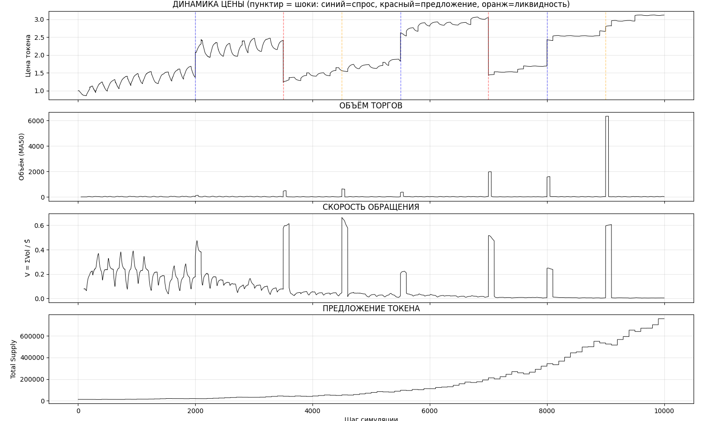
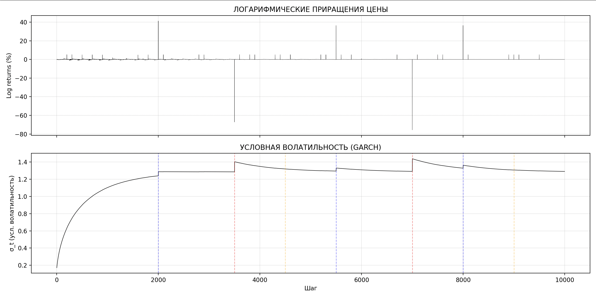
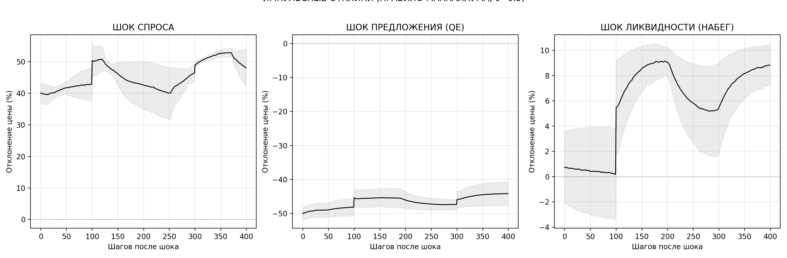
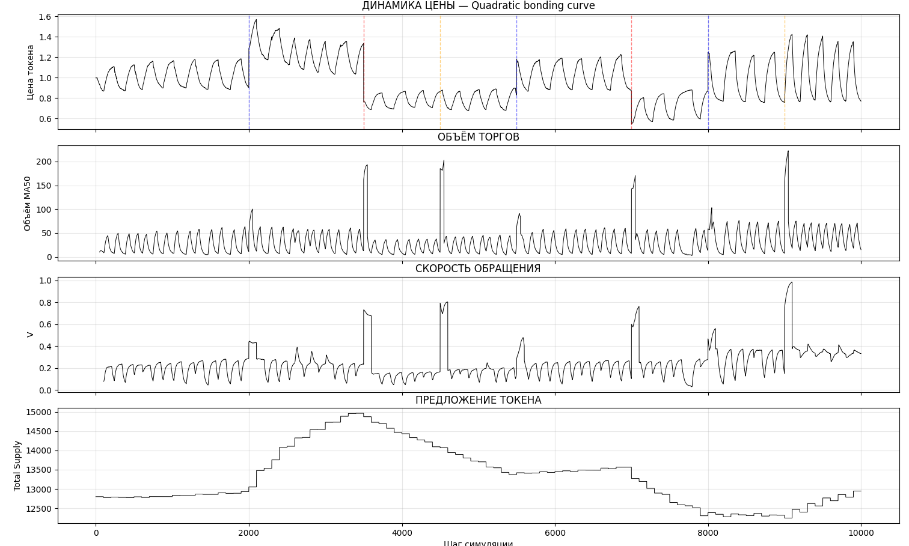
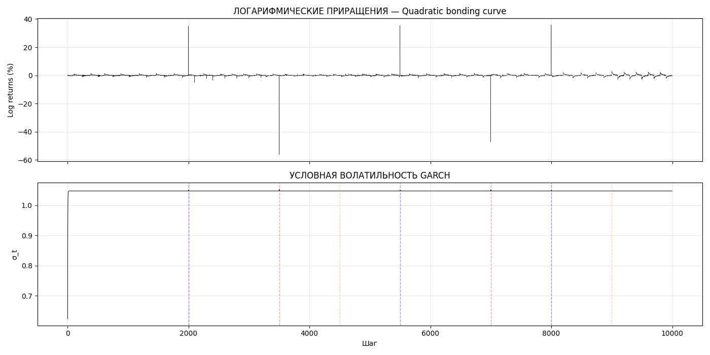
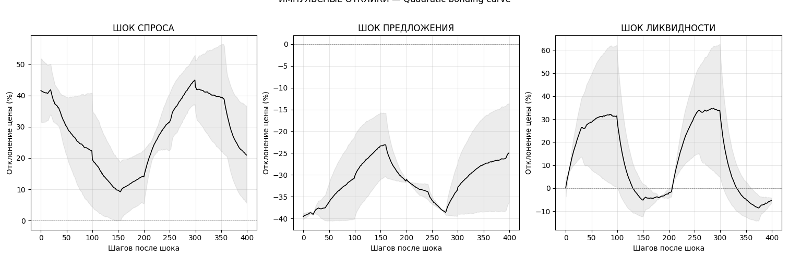
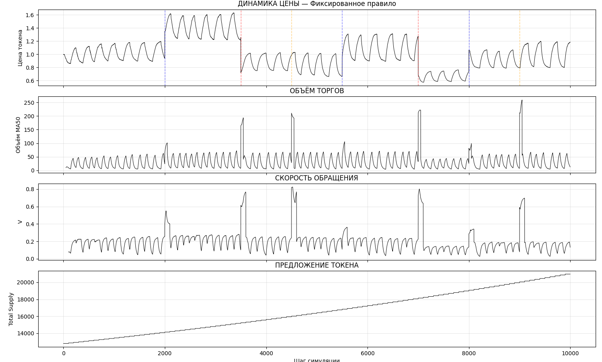
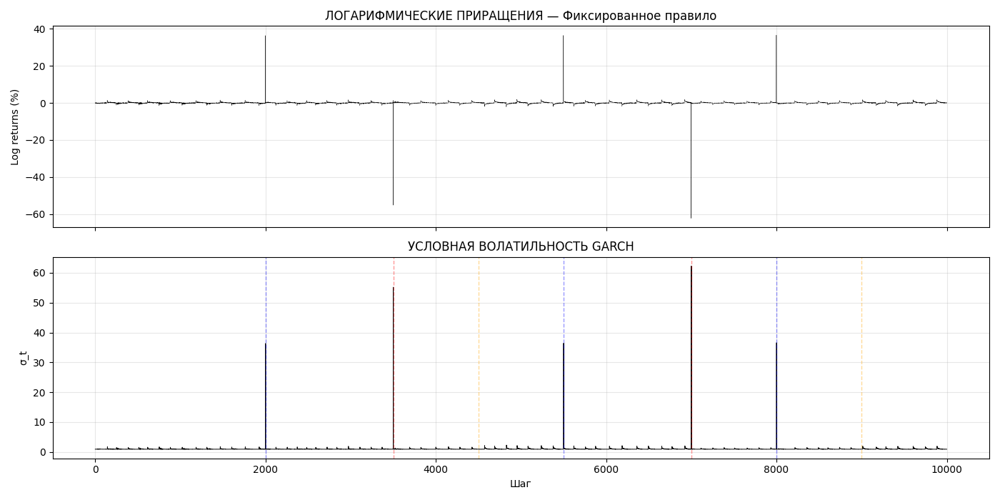
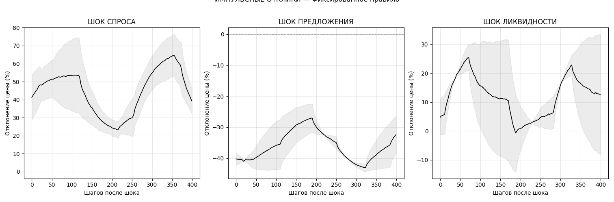

Домашнее задание

Начальная симуляция
параметры:
Начальная цена: 1.0000
Начальный k: 100000000
Агентов: 6
Расписание шоков: спрос {2000, 8000, 5500}, предложение {7000, 3500}, ликвидность {9000, 4500}
Симуляция завершена: 10000 шагов
Финальная цена: 3.1198
Шоков произошло: 7
Наблюдений: 9999
Среднее: 0.0114%
Ст.откл.: 1.2484%
                       Zero Mean - GARCH Model Results                        
==============================================================================
Dep. Variable:                  price   R-squared:                       0.000
Mean Model:                 Zero Mean   Adj. R-squared:                  0.000
Vol Model:                      GARCH   Log-Likelihood:               -16148.1
Distribution:                  Normal   AIC:                           32302.1
Method:            Maximum Likelihood   BIC:                           32323.7
                                        No. Observations:                 9999
Date:                Sat, May 16 2026   Df Residuals:                     9999
Time:                        09:02:57   Df Model:                            0
                               Volatility Model                              
=============================================================================
                 coef    std err          t      P>|t|       95.0% Conf. Int.
-----------------------------------------------------------------------------
omega      2.1476e-03  1.913e-03      1.123      0.262 [-1.602e-03,5.897e-03]
alpha[1]   6.9993e-05  2.596e-04      0.270      0.787 [-4.387e-04,5.787e-04]
beta[1]        0.9987  1.831e-03    545.481      0.000      [  0.995,  1.002]
=============================================================================

Covariance estimator: robust

--- Интерпретация ---
omega = 0.002148
alpha = 0.0001  (краткосрочная реакция на шок)
beta  = 0.9987  (персистентность волатильности)
alpha + beta = 0.9988  (близко к 1 = IGARCH, шоки перманентны)
=======================================================
  СВОДНАЯ ТАБЛИЦА МЕТРИК (для сравнения с группами)
=======================================================
                                Метрика          Значение
                      Правило МакКаллум            (θ=0.5)
Волатильность (ст.откл. log returns, %)            1.2484
                     Макс. просадка (%)            -53.28
          Среднее время возврата (шаги)               443
                            GARCH alpha            0.0001
                             GARCH beta            0.9987
         GARCH alpha+beta (persistence)            0.9988
=======================================================

графики:

Вопросы:

- Как правило МакКаллума реагирует на шоки? Сравните отклики на три типа шоков. Какой шок наиболее дестабилизирующий? Почему?
Правило МакКаллума реагирует на объём торгов и скорость обращения токена. Поэтому после любого шока правило видит рост активности в системе: увеличивается объём торгов, а вместе с ним меняется скорость обращения. Если после шока объём торгов резко вырос, правило воспринимает это как перегрев. Тогда значение Δm становится ниже, и система начинает birn'ить токена

Наиболее дестабилизирующим в моей симуляции является шок предложения. Он даёт самое сильное падение цены и хуже всего восстанавливается. Причина в том, что правило МакКаллума реагирует с задержкой и ориентируется не на саму цену, а на объём торгов и скорость обращения. Поэтому оно не может сразу компенсировать резкое увеличение предложения токена.

- Скорость обращения: как V меняется после шоков? Видите ли вы компенсирующую реакцию правила МакКаллума (эмиссия корректируется с учётом ΔV)?
После шоков V резко растёт. Это логично: любой шок создаёт разовую крупную операцию в пуле, поэтому объём торгов резко увеличивается. Например, после шока спроса на 2000 эпохе V растет примерно с 0.18 до 0.45.
Дальше скорость обращения постепенно снижается. Когда V и объём торгов резко растут, правило воспринимает это как перегрев системы и birn'ит токены. Это же видно и на графике Total Supply. Но полностью стабилизировать V правило не может. Оно влияет только на знаменатель формулы — предложение токена. А основной скачок V возникает из-за числителя, то есть из-за объёма торгов. Спустя несколько эпох всплеск выходит из окна расчёта и V резко падает.

- GARCH: чему равна persistence (α+β)? Близка ли к 1? Что это означает для политики ЦБ — как быстро стабилизируется система?
alpha = 0.0001
beta = 0.9987
persistence = alpha + beta = 0.9988

Это значение очень близко к 1, то есть волатильность в системе очень устойчивая. После шока она быстро не исчезает, а долго сохраняется в динамике цены.

При этом alpha почти нулевая, то есть модель почти не реагирует на новый краткосрочный шок отдельно. Основной эффект идёт через beta, то есть через прошлую волатильность. Если система уже стала волатильной, она долго остаётся в таком состоянии.

Для политики ЦБ это негативный сигнал: система стабилизируется медленно. Правило МакКаллума не может быстро погасить шоки, потому что оно реагирует через объём торгов и скорость обращения, а не напрямую на волатильность цены. Поэтому при persistence около 0.9988 шоки можно считать почти перманентными, и ЦБ нужна более быстрая или более жёсткая реакция политики.

- Сравнение с другими группами: после получения таблиц от групп с правилами Тейлора, bonding curve и фиксированным — какое правило даёт наименьшую волатильность? Наименьшую просадку? Быстрейшее восстановление? Есть ли trade-off?

СРАВНИТЕЛЬНАЯ ТАБЛИЦА
==========================================================================================
                Правило  Волатильность  Макс. просадка  Среднее время возврата  GARCH alpha  GARCH beta  GARCH persistence
     Правило МакКаллума       1.248435      -53.281362              442.857143     0.000070    0.998696           0.998766
  Фиксированное правило       1.099860      -64.787173              371.714286     1.000000    0.000000           1.000000
Quadratic bonding curve       1.047132      -65.382049              257.857143     0.000004    0.661771           0.661775

Если сравнивать таблицы по всем правилам, то ни одно правило не выигрывает по всем метрикам сразу.

Наименьшую волатильность даёт quadratic bonding curve. Цена в модели сильнее сглаживается самой механикой кривой: изменение цены зависит от предложения более плавно, поэтому система меньше дёргается после отдельных сделок.

Наименьшую просадку даёт правило МакКаллума. В моей модели оно после перегрева начинает burn токенов, поэтому падение цены частично ограничивается. Но минус в том, что восстановление получается медленным, потому что правило реагирует не на цену напрямую, а через объём торгов и скорость обращения.

Быстрейшее восстановление показывает фиксированное правило. Скорее всего, потому что оно меньше вмешивается в систему. Оно не пытается каждый раз сильно перестраивать предложение после шока, поэтому рынок быстрее сам возвращается к норме. Но это не значит, что фиксированное правило лучше по всем параметрам.

- Что бы вы рекомендовали ЦБ для дизайна CBDC? На основании ваших результатов — condition-dependent правило или фиксированное? Почему?

Я бы рекомендовал ЦБ использовать condition-dependent правило, но не обязательно именно правило МакКаллума в таком простом виде, как в нашей модели.

Фиксированное правило в симуляции выглядит неплохо: оно простое, меньше вмешивается в систему и быстрее возвращает цену. Но его проблема в том, что оно вообще не смотрит на состояние экономики. Condition-dependent правило лучше подходит для CBDC, потому что оно хотя бы пытается учитывать состояние системы, что и является целью ЦБ. В нашей модели МакКаллум реагирует на объём торгов и скорость обращения. Это не идеально, потому что он не учитывает напрямую цену и волатильность, из-за чего после сильных шоков восстановление получается медленным. Поэтому для реального ЦБ я бы выбрал condition-dependent подход, но с более широкой логикой. Нужно учитывать не только V и объём торгов, но ещё волатильность, просадку цены, ликвидность и, возможно, внешние макроиндикаторы. 
